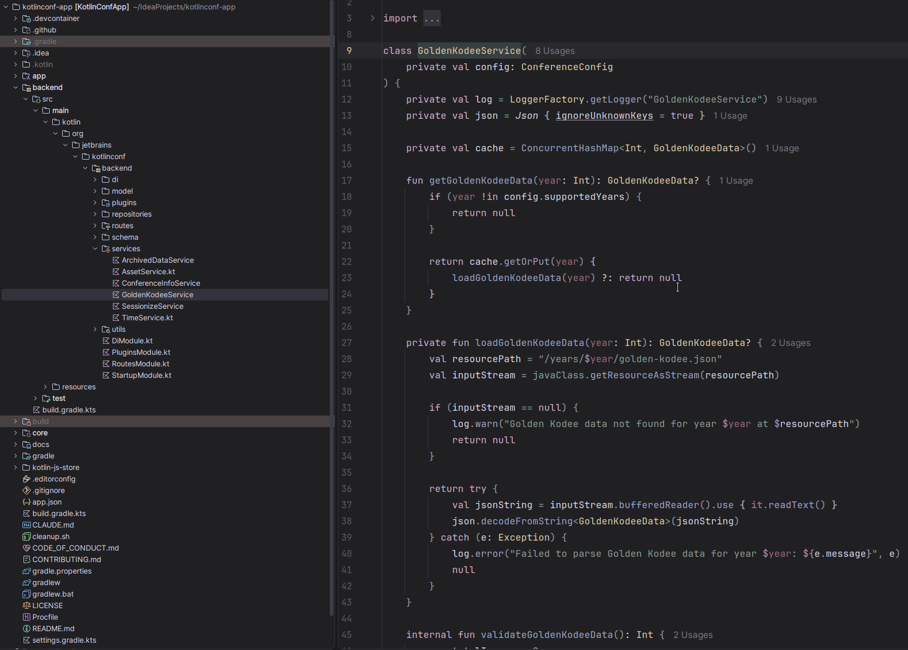
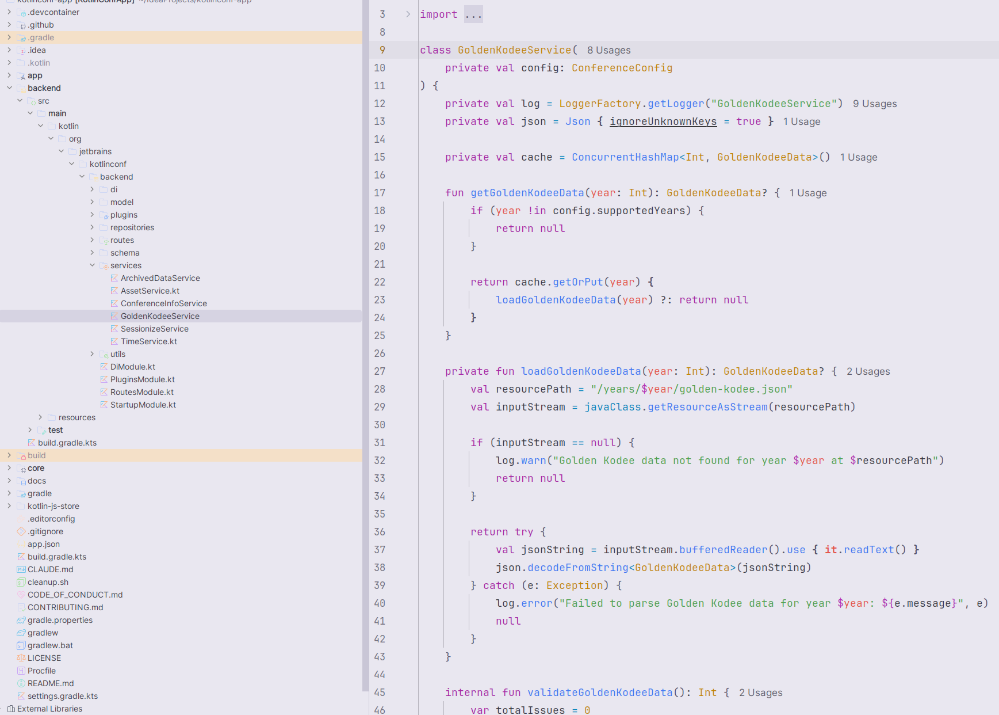

# Petrichor for JetBrains IDEs

A JetBrains/IntelliJ port of [Petrichor](https://github.com/PersonForSure/petrichor), a color
scheme inspired by the colors of rainy days — cozy, soft, and practical.

<details>
<summary>Preview</summary>





</details>

## Variants

| Theme | Editor scheme |
| --- | --- |
| Petrichor Dark | `Petrichor Dark` |
| Petrichor Light | `Petrichor Light` |
| Petrichor Dark (Islands) | `Petrichor Dark` |
| Petrichor Light (Islands) | `Petrichor Light` |

The *Islands* variants target the Islands UI introduced in the 2025.2 IDEs: the tool windows and
the editor are rendered as rounded "islands" floating over a dimmed window background.

## Design

Petrichor keeps its signature **highlighted comments** (bright cyan, italic), but the
token-to-color assignment follows the [Catppuccin](https://github.com/catppuccin)
theme, remapped onto the Petrichor palette.

| Role | Color |
| --- | --- |
| Keywords | bright magenta |
| Identifiers, constants, numbers | yellow |
| Strings | bright green |
| String escapes | magenta |
| Comments, doc comments | bright cyan, italic |
| Doc comment tags | bright red |
| Functions, methods | bright blue |
| Classes, interfaces, annotations, attributes | bright yellow |
| Tags, static fields, operators | cyan |
| Parameters, globals, entities | red |
| Local variables, fields, labels | foreground |
| Predefined symbols | blue |
| Punctuation, brackets | grey |

### Dark palette

| Name | Hex | | Name | Hex |
| --- | --- | --- | --- | --- |
| `bg0` | `#202023` | | `fg` | `#d9d6e9` |
| `bg1` | `#29292c` | | `red` | `#9c6b7a` / `#ae808f` |
| `bg2` | `#33333b` | | `green` | `#838984` / `#8d9b92` |
| `bg3` | `#3d3d45` | | `yellow` | `#c4afa2` / `#e0cca8` |
| `bg4` | `#47474f` | | `blue` | `#8d96bd` / `#9da4c8` |
| `bg5` | `#52525c` | | `magenta` | `#b694b6` / `#d2aece` |
| `bg_dim` | `#1a1a1d` | | `cyan` | `#86a3a6` / `#9cb9c0` |

### Light palette

The light variant keeps the same hues and low saturation, mirrored onto a soft lavender-grey
paper background (`#e9e7f0`) with a dark neutral foreground (`#3b3b44`).

## Building

The plugin is a DevKit theme plugin — no source code, only resources:

```
resources/
├── META-INF/
│   ├── plugin.xml
│   └── pluginIcon.svg
└── themes/
    ├── Petrichor_Dark.theme.json
    ├── Petrichor_Dark_Islands.theme.json
    ├── Petrichor_Dark.xml
    ├── Petrichor_Light.theme.json
    ├── Petrichor_Light_Islands.theme.json
    └── Petrichor_Light.xml
```

Use **Build | Prepare Plugin Module 'Petrichor' For Deployment** in IntelliJ IDEA to produce the
installable JAR, then install it via **Settings | Plugins | Install Plugin from Disk…**.

## Credits

- Original color scheme: [Monocled](https://github.com/PersonForSure/petrichor)
- JetBrains Catppuccin port: [Catppuccin](https://github.com/catppuccin/jetbrains)
